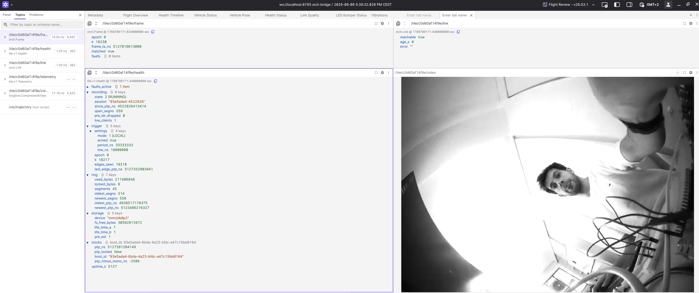

# Quick hardware test

Run from `Seb_work_trial/` on the laptop. Assumes the camera is configured and the
tile agent is running at `192.168.168.2:8080` (see `orch/orch.yaml`), with
`--beacon-src http://127.0.0.1:8080/v1/trigger/log` on this single-board bench.

## Connect, trigger, record

```sh
python3 -m orch nodes
python3 -m orch health
python3 -m orch time
python3 -m orch trigger --period-ns 33333333 --low-ns 15000000 --arm
python3 -m orch start --edges ptp
python3 -m orch watch                 # watch ~20 s; Ctrl-C leaves recording running
python3 -m orch segments --last 30
```

The trigger runs at 30 Hz; its 15 ms low pulse sets exposure. Leave `--latency-ns`
unset. A free-running clock warning is expected without a PTP master.
Full 4-second segments should have about 120 frames, with K advancing by one
across boundaries. Startup `K_LOCAL` means unanchored numbering; `K_CORRECTED`
marks beacon alignment. Inspect other faults and unexpected gaps.

## View while recording

```sh
ffplay http://192.168.168.2:8080/v1/live
```

The proxy is H.264, 728×544 at 15 fps; recording is H.265. Live view requires
active recording. For Foxglove:

```sh
python3 -m venv ~/.venv/orch
~/.venv/orch/bin/pip install -r orch/requirements.txt
~/.venv/orch/bin/python -m orch bridge
```

Connect to the printed address and import `orch/foxglove/tiles.json`.



## Restart, fetch, inspect

```sh
python3 -m orch stop
python3 -m orch start --edges ptp      # leave the trigger running between sessions
sleep 25
python3 -m orch stop
python3 -m orch segments --last 120
python3 -m orch fetch --last 120 --out ./rec --check
python3 tools/frame_index.py --summary rec/*/seg/*.h265
python3 tools/frame_index.py --gaps rec/*/seg/*.h265
ssh evm '/opt/ti_workspace/pipeline/build/segfile/ringfsck /ring'
```

After beacon alignment, the second session should recover the source's ongoing
epoch/K; pulses during the recording pause naturally leave a gap. Fetch should
report zero vanished/short files; investigate check findings. Repeating fetch
resumes interrupted downloads. `--gaps` exits nonzero for notable frames,
including beacon corrections; `ringfsck` checks structure/metadata, not decoding.
Play one downloaded `.h265` file with `ffplay` to check its picture.

Optional time selection and retention:

```sh
python3 -m orch fetch --from 14:00 --to 14:05 --out ./rec --check
python3 -m orch lock evt-1 --last 60 --reason test
python3 -m orch locks
python3 -m orch unlock evt-1
```

If time selection is refused, use `--last` or `--k EPOCH:FROM:TO`. For persistent
`K_LOCAL`, check the agent's beacon source; for `LATE`, remove a manual latency
override; for `fps=0`, check pulses; for `ERROR`, check camera availability.
For a dark picture, check lighting/gain (bench:
`ssh evm 'v4l2-ctl -d /dev/v4l-subdev2 --set-ctrl analogue_gain=300'`). Use `ringfsck /ring --repair`
only with recording stopped. This is a greyscale, single-camera smoke test.
