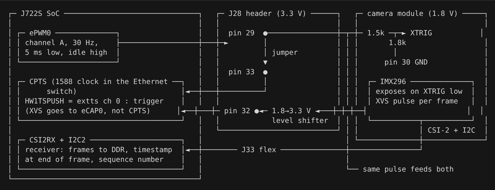
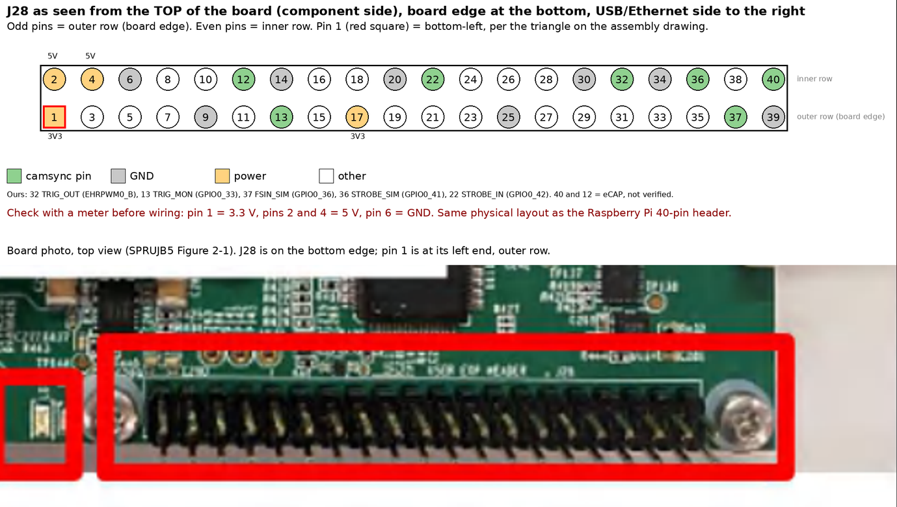

# Wiring

How to connect the EVM to the cam:

- Cam via fpc into J33 of EVM (I2C and CSI)
- Cam XTRIG to J28.29 needs level shift 1V8/3V3 (only connect if triggering from epwm of TI evm)
- Cam XVS to J28.32 needs level shift 1V8/3V3 (exposure validation)
- Trigger line to J28.33 (ptp time capture of edge). Currently jumper from J28.29 (no external trigger)

